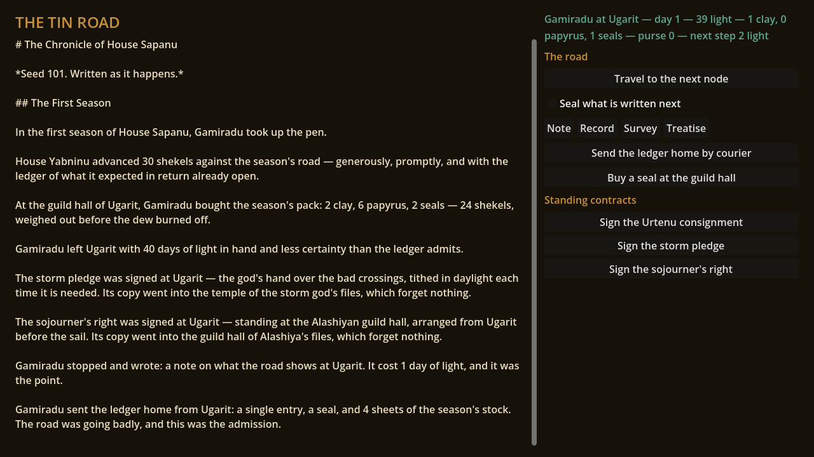
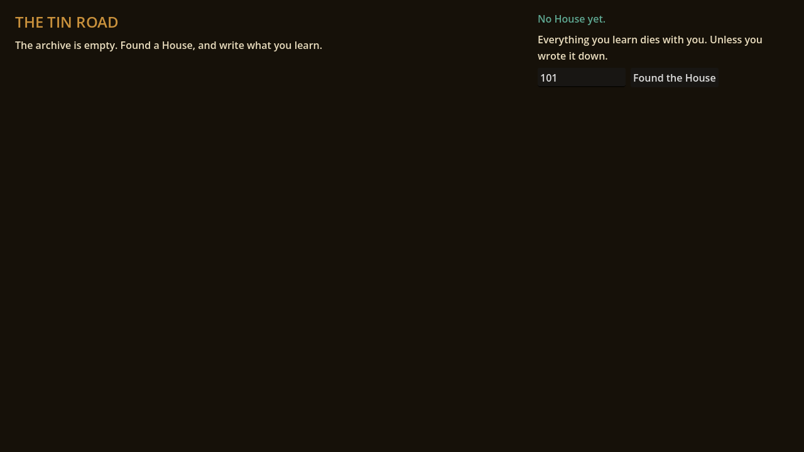
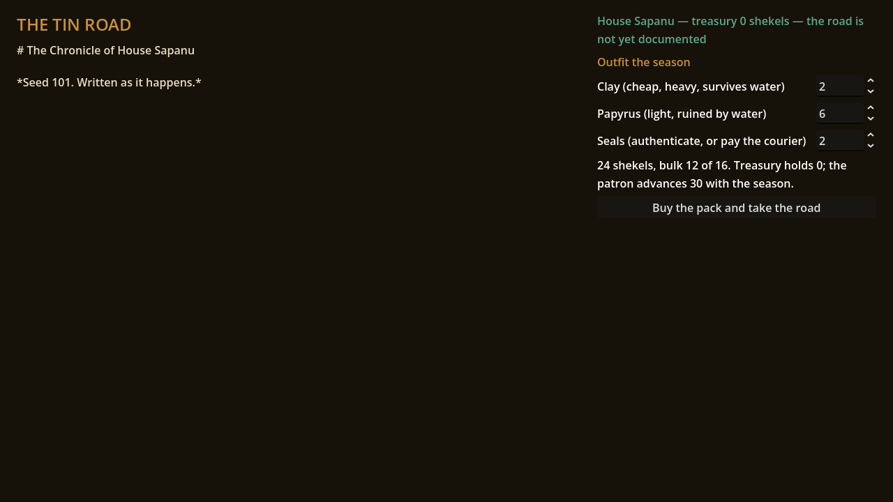

# The Tin Road

A run-based generational trading game set in **The Long Bronze** — an alternate
history where the Bronze Age never collapsed, seven centuries of peace have
made writing cheap, and the printing press has just arrived three thousand
years early.

You are not the hero. You are the House: a minor merchant family whose scribes
walk the tin routes one mortal lifetime at a time. **Everything a scribe
learns dies with them — unless they wrote it down.** Documentation is the
meta-progression, the automation system, and the point.

Built with Godot 4.6. Everything is text; the repo is the game.



<details>
<summary>More screenshots: founding a House, outfitting the season</summary>





</details>

## The pitch, demonstrated

Every playthrough is event-sourced into a chronicle, and the chronicle renders
as prose. This is seed 101, unedited, from `docs/sample-chronicle.md`:

> A standing order went into the archive of House Sapanu — 100 shekels to the
> guild scribes and the drover bond, and the Ugarit road became a road that
> runs itself on paper first.
>
> While the House slept, a caravan walked the Ugarit road on its own and came
> home with 362 shekels, weighed. The drovers took their 60 at the gate. The
> road remembered; it had been written down.
>
> …
>
> The season ended where it stood, at the Rival Sail. What Attenu had not sent
> ahead never reached the archive.
>
> 358 shekels arrived from the Ugarit road, earned by a road walking itself,
> less the 60 the caravan costs to exist. The archive, as usual, said nothing
> and did everything.

Seven generations charted that road — as unsealed rumour, then sealed fact —
paid for their contracts in writing stock, lost a season's papyrus to the
marsh, and finally posted the standing order. Then a scribe died on the road,
and the caravan came home anyway. Nobody authored that story — the sim
emitted it, the renderer wrote it. Same seed, same book, every time.

## Quickstart

Requires [Godot 4.6.x](https://godotengine.org/download/) and git.

```bash
git init && git add -A && git commit -m "Season zero"
./scripts/setup.sh        # fetch the pinned test framework, prime imports
./scripts/check.sh        # import + scene smoke + the full test suite + demo determinism
```

Then either open the project in the Godot editor and press play, or stay
headless like a scribe of the road script:

```bash
godot --headless --path . -s scripts/demo_season.gd
TIN_SEED=735 TIN_SEASONS=8 godot --headless --path . -s scripts/demo_season.gd
```

Every seed is a different house, a different sequence of deaths and ledgers,
a different book. Seed 101 is the committed sample; seed 1259 — the Treaty
year — anchors the determinism check.

The same log the book is rendered from is also read for numbers:

```bash
godot --headless --path . -s scripts/measure.gd    # the vertical slice's five signals
```

Four of the five are computed from the chronicle. The fifth — the reaction at
the first automated return — is not, and will not be: the design says "watch
faces, not surveys", so the pass locates the moment and prints `[NOT MEASURED]`
against it. `docs/design/measurement.md` covers what each signal is computed
from and the bands it is judged against; `docs/design/playtest-script.md` is
the observation protocol for the parts a person has to be in the room for.

## Play it in a browser

The playable beta is a web export. CI builds it on every push as the
`the-tin-road-web` artifact (Actions → latest run → Artifacts); unzip and
serve the folder from any static host — threads are disabled, so no special
headers are needed. Or build it locally:

```bash
./scripts/export_web.sh                     # fetches web templates if absent
python3 -m http.server -d build/web 8080    # then open localhost:8080
```

Found a House, buy the pack (clay is heavy, papyrus drowns), walk the road
choosing when to write and what to seal, and read the book you are making as
it grows. Season one can kill you — that is what the courier is for. Document
all three legs, post the standing order, and watch a caravan walk your road
without you.

## The ebook pipeline

The lore the game reads and the book you'd publish are the same files.
`data/codex/*.md` holds the setting entries (front matter marks which are
`[real]` attested history); the build compiles them:

```bash
./scripts/build_codex.sh   # -> build/long-bronze-codex.md (+ .epub if pandoc)
```

The chronicle of any playthrough is already markdown. "First DLC is an ebook"
is not a roadmap item; it is `pandoc` away.

## Where things are decided

`ROADMAP.md` is the build order — every deferred system lives there with a
pointer to its design. `docs/toolchain.md` is the tool policy (headless/API
or it doesn't enter), including the working-from-a-phone workflow.
`docs/art-direction.md` keeps the fresco standard.

## Repo map

```
sim/          Pure, deterministic simulation. No Nodes, no prose. Emits events.
chronicle/    Renderer (events -> prose) and the demo runner.
measure/      The same events -> numbers. Reads the log; never a system in sim/.
data/         Content: routes, names, prose templates, tuning bands, codex.
game/         Scenes. Thin. Currently: a button that chronicles a house.
tests/        gdUnit4 suites. ./scripts/check.sh is the definition of done.
docs/         Design bible (docs/design/, docs/world/) + the sample chronicle.
scripts/      setup, check, demo, measure, codex build.
CLAUDE.md     Working agreement for AI agents: conventions, constraints, rules.
```

## What this is not, yet

This is vertical-slice steps 1–5 of `docs/design/vertical-slice.md`: the season
clock, daylight, travel, the four ledger entry types, death and succession, the
Courier, seals and rumours, the outfit step, Standing Contracts, media that
matters on the road, and assignable automation — the loop
**write → die → inherit → automate → read the book**, complete in the sim, with
a text-first playable layer over it and the measurement plan that closes
milestone 1. What the measurement has not had yet is **playtests** — the
apparatus exists, the sessions have not been run, and until they are, the
slice's question is unanswered rather than answered well.
Not built: the Keeper and Endurance, archive corruption, incident reports and
caravan loss, order revocation, factions, presses, real UI, saves, any audio at
all. The design docs know the way.

## License

Undecided — all rights reserved for now. (The attested names and the Treaty
belong to history, which does not enforce copyright.)
